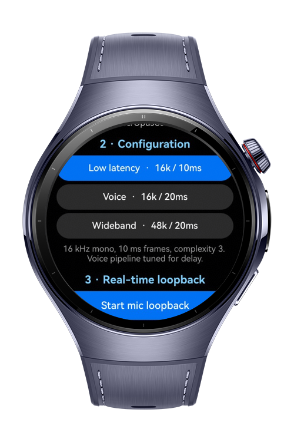

> **Note:** To access all shared projects, get information about environment setup, and view other guides, please visit [Explore-In-HMOS-Wearable Index](https://github.com/Explore-In-HMOS-Wearable/hmos-index).

# How To Use Opuscodec

A HarmonyOS wearable sample that shows the three things the Opus codec is
normally needed for on device:

1. **Initialisation and configuration** of an Opus encoder and decoder.
2. **Real-time encoding and decoding** with low-latency settings, measured live.
3. **Handing the result to AVPlayer and AVSessionKit** for playback and system
   media controls.

# Preview

<div>
  
</div>

# Use Cases

- Query what the device's AVCodec service actually offers for `audio/opus`
  before creating anything, and report it instead of failing later
- Configure an Opus encoder and decoder from named presets covering sample
  rate, bitrate, complexity and frame duration
- Run a live microphone loopback through encode and decode, and read the
  round-trip cost frame by frame
- Export a session as a WAV file or as a raw Opus packet container
- Hand a recorded session to AVPlayer and publish it to AVSessionKit for system
  media controls

# Technology

## Stack

- **Languages**: ArkTS, C++
- **Frameworks**: HarmonyOS Stage Model, AVCodec NDK
- **Tools**: DevEco Studio, Hvigor, CMake
- **Libraries**:
	- `@kit.AudioKit`
	- `@kit.MediaKit`
	- `@kit.AVSessionKit`
	- `@kit.AbilityKit`
	- `libnative_media_codecbase.so`, `libnative_media_core.so`, `libace_napi.z.so`

## Required Permissions

- `ohos.permission.MICROPHONE` — declared in `module.json5` and requested at
  runtime before the loopback starts

## Why there is a C++ layer

ArkTS `media.CodecMimeType` exposes AAC, FLAC, Vorbis, MP3, G.711 µ-law and AMR
— but no Opus. Opus is only reachable through the AVCodec NDK, as
`OH_AVCODEC_MIMETYPE_AUDIO_OPUS` (`"audio/opus"`, available since API 11).

So the codec runs in `entry/src/main/cpp` and is published to ArkTS as the NAPI
module `libopuscodec.so`. Everything else — capture, playback, session,
file I/O, UI — stays in ArkTS.

# Directory Structure

```
entry/src/main/cpp
  opus_session.h/.cpp   OH_AudioCodec_* wrapper, one instance per direction
  napi_init.cpp         NAPI surface, threadsafe callback into ArkTS
  types/libopuscodec/   Index.d.ts, the ArkTS view of the module

entry/src/main/ets
  model/OpusProfiles.ets    presets (sample rate, bitrate, complexity, frame ms)
  service/OpusCodec.ets     codec lifecycle + capability queries
  service/PcmBuffers.ets    frame splitter, jitter ring buffer, PCM collector
  service/OpusLoopback.ets  mic -> encode -> decode -> speaker pipeline
  service/MediaExport.ets   WAV writer and raw Opus packet container
  service/SessionPlayer.ets AVPlayer + AVSession
  pages/Index.ets           the watch UI
```

## 1. Initialisation and configuration

`OH_AVCodec_GetCapability("audio/opus", isEncoder)` is queried before anything
is created, so the app can report what the device actually offers (codec name,
hardware or software, supported sample rates, channel and bitrate ranges,
complexity range) instead of failing later. Section 1 of the UI shows it.

Configuration goes through `OH_AVFormat`:

| Key | Meaning here |
| --- | --- |
| `OH_MD_KEY_AUD_SAMPLE_RATE` | 8k / 12k / 16k / 24k / 48k |
| `OH_MD_KEY_AUD_CHANNEL_COUNT` | 1 or 2 |
| `OH_MD_KEY_AUDIO_SAMPLE_FORMAT` | `SAMPLE_S16LE` |
| `OH_MD_KEY_BITRATE` | target bitrate, encoder |
| `OH_MD_KEY_AUDIO_COMPRESSION_LEVEL` | Opus complexity 0..10, encoder |
| `OH_MD_KEY_IDENTIFICATION_HEADER` | synthesised `OpusHead`, decoder |

The decoder is a special case: without a container there is no demuxer to
deliver the Opus identification header, so `opus_session.cpp` builds the 19 byte
`OpusHead` (RFC 7845) itself. If a device rejects that key, `Create()` retries
with the plain description and the UI shows which path was taken
("Decoder cfg" row). The encoder's own codec-data output, if it emits one, is
also forwarded to the decoder at runtime.

Three presets are available in section 2:

| Preset | Setup | Point |
| --- | --- | --- |
| Low latency | 16 kHz mono, 10 ms frames, complexity 3, 24 kbps | shortest delay |
| Voice | 16 kHz mono, 20 ms frames, complexity 5, 24 kbps | usual VoIP default |
| Wideband | 48 kHz mono, 20 ms frames, complexity 8, 64 kbps | quality over CPU |

## 2. Real-time encode and decode

Section 3 runs the full chain:

```
AudioCapturer(readData)
  -> FrameSplitter (HAL buffer size -> exact Opus frame)
  -> encoder.push()            OH_AudioCodec_PushInputBuffer, never blocks
  -> onEncoded (codec thread -> ArkTS via napi_threadsafe_function)
  -> decoder.push()
  -> onDecoded -> PcmRingBuffer
  -> AudioRenderer(writeData)
```

What keeps the delay down:

- **Frame size is the floor.** 10 ms frames instead of 20 ms halve the
  buffering delay; the preset makes the difference visible on screen.
- **Nothing waits.** `push()` takes a free input buffer or returns `false`; the
  dropped-frame counter makes back pressure visible instead of hiding it in a
  blocking call.
- **Output buffers are released immediately** in `OnNewOutputBuffer`, before the
  frame is handed to ArkTS.
- **A three-frame jitter buffer** absorbs a late codec callback without letting
  the renderer starve. Underruns are counted and shown in milliseconds.
- **`SOURCE_TYPE_VOICE_COMMUNICATION` and `STREAM_USAGE_VOICE_COMMUNICATION`**
  ask the system for the voice path, which is the low-latency route and brings
  echo cancellation — needed because this is literally a microphone-to-speaker
  loop.

Live readings: measured bitrate, average packet size, compression ratio against
raw PCM, encode and decode latency (measured inside the codec, push to output)
and the end-to-end microphone-to-speaker figure.

Use headphones. The loop plays the microphone back through the speaker.

## 3. AVPlayer and AVSessionKit

Section 4 exports the last run and plays it back.

AVPlayer has no raw Opus elementary stream input, and the muxer NDK writes
mp4/m4a/mp3/amr/wav/aac only — not Ogg. The integration point is therefore the
decoded PCM: AVCodec decodes Opus, the sample wraps the PCM in a RIFF/WAVE
header, and AVPlayer takes it from there through `fdSrc`.

Both files land in the app sandbox (`context.filesDir`):

- `loopback.wav` — decoded audio, what AVPlayer plays.
- `loopback.opusraw` — the encoded packets with a small length-prefixed header
  (`"OPUSRAW1"`, sample rate, channels, frame ms, then `u16` length + payload
  per packet), since Opus packets are not self-delimiting outside a container.

AVSessionKit then publishes the playback: metadata (`assetId`, title, artist,
duration) and playback state are pushed to the system, and the `play`, `pause`,
`stop` and `seek` commands are wired back to the same AVPlayer instance. The
whole session part is guarded by
`canIUse('SystemCapability.Multimedia.AVSession.Core')`, so on a device without
AVSession the player still works and the UI says so.

## Building

```
hvigorw --mode module -p product=default -p buildMode=debug assembleHap
```

`abiFilters` is set to `arm64-v8a` and `x86_64`. The HAP carries
`libs/<abi>/libopuscodec.so`.

## Reading the numbers

- `Encode` / `Decode` are the codec round trips only.
- `Mic to speaker` is capture callback to decoded PCM ready for the renderer; it
  does not include the renderer's own buffering, so the delay you hear is a bit
  higher than the number shown.
- `Dropped` should stay at 0. A rising count means the codec is not keeping up
  with the capture rate — lower the complexity or the sample rate.
- `Underrun` counts the silence the renderer had to play because the decoded
  frame had not arrived yet.

# Constraints and Restrictions

## Supported Device

- Huawei Watch 5
- HarmonyOS smart wearables
- Round-screen wearable layouts are the primary target

## Known Limitations

- **The device must actually carry an Opus codec, and not every wearable does.**
  On a Huawei Watch 5 running HarmonyOS 6.0.1,
  `OH_AVCodec_GetCapability("audio/opus", ...)` fails for both directions:

  ```
  NativeAVCapability: Get capability failed: cannot find matched capability
  ```

  Neither `/system/lib64` nor `/vendor/lib64` carries an Opus library and no
  codec configuration under `/system/etc` or `/vendor/etc` mentions Opus, so the
  encoder and decoder are genuinely absent rather than merely unregistered. This
  is exactly what the capability query in section 1 exists to surface: the app
  reports it on the first screen instead of failing when a codec is created.
- **`abiFilters` is limited to `arm64-v8a` and `x86_64`.** Other ABIs need a
  CMake configuration change.
- **AVSession is optional.** The session path is guarded by
  `canIUse('SystemCapability.Multimedia.AVSession.Core')`; without it the player
  still works and the UI says so.

# License

**How To Use Opus Codec** is distributed under the terms of the MIT License. See the [LICENSE](LICENSE) for more information
